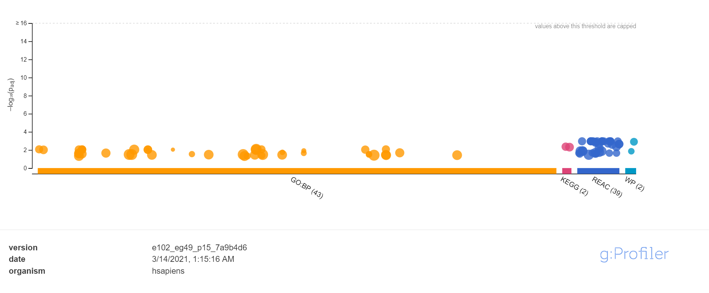
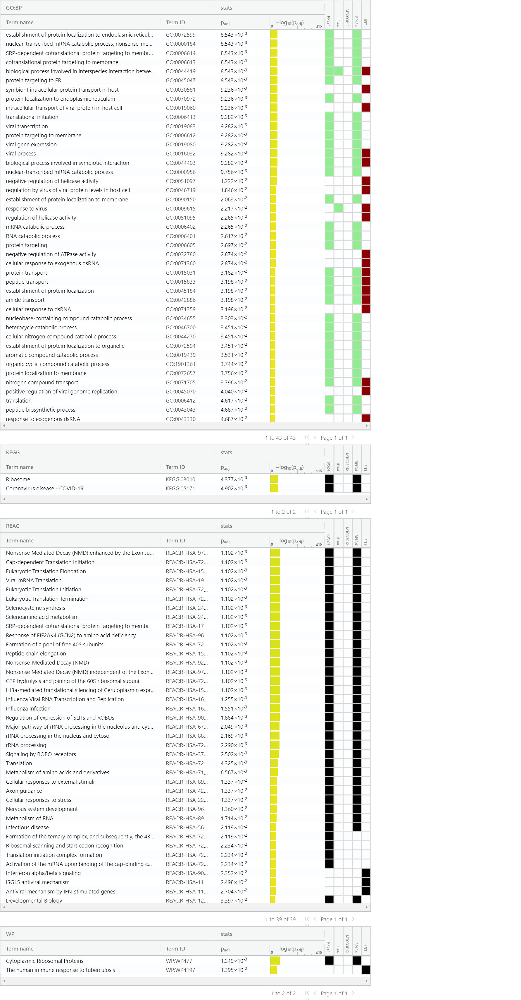
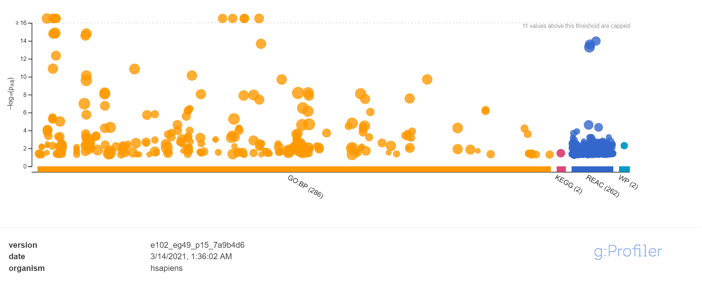
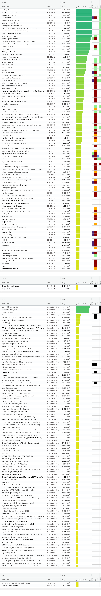
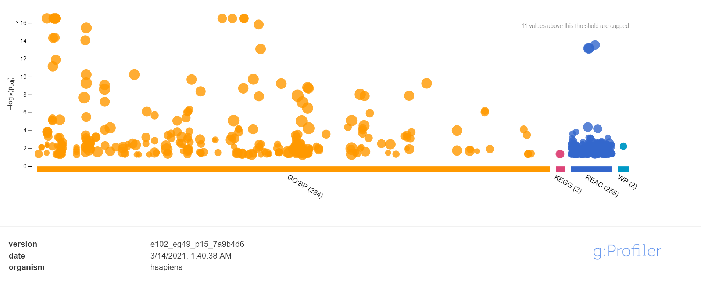
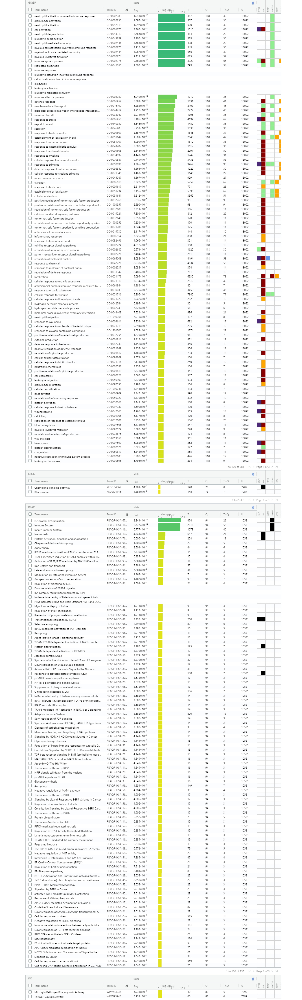

# Assignment 1 summary

install all packages if needed, then library them. if file normalized_data.rds
and filtered_data.rds does not exist, rerun A1.

```{r, message=FALSE, results='hide', warning=FALSE}

#install Biocmanager in order to install necessary package
if (!requireNamespace("BiocManager", quietly = TRUE))
  install.packages("BiocManager")

#install necessary package if not installed
if (!requireNamespace("GEOmetadb", quietly = TRUE))
  BiocManager::install("GEOmetadb")

if (! requireNamespace("GEOquery", quietly = TRUE)) {
  BiocManager::install("GEOquery")
}

if (! requireNamespace("edgeR", quietly = TRUE)) {
  BiocManager::install("edgeR")
}

# install limma if not exist
if (! requireNamespace("limma", quietly = TRUE)) {
  BiocManager::install("limma")
}

if (! requireNamespace("ComplexHeatmap", quietly = TRUE)) {
  BiocManager::install("ComplexHeatmap")
}

if (! requireNamespace("circlize", quietly = TRUE)) {
  install.packages("circlize")
}

library(dplyr)
library(GEOmetadb)
library(GEOquery)
library(edgeR)
library(knitr)
library(RSQLite)
library(limma)
library(ComplexHeatmap)
library(circlize)

# load all data from A1
if (! file.exists("./normalized_data.rds") || ! file.exists("filtered_data.rds")){
  rmarkdown::render("BCB420_A1.Rmd")
}
```

First, we want to get the description for dataset
.
```{r, results=FALSE, message=FALSE}
# First, we want to get the description for dataset GSE145412. 
gse <- getGEO("GSE145412",GSEMatrix=FALSE)
kable(data.frame(head(Meta(gse))), format = "html")
```

Then we want to show more information associated with the dataset.

```{r, results=FALSE, warning=FALSE}
# Then, we want to get information about the dataset
current_gpl <- names(GPLList(gse))[1]
current_gpl_info <- Meta(getGEO(current_gpl))
```

The first assignment was focused on clean up data, grouping, and using TMM method to normalized the dataset. the results are shown in both boxplot and density plot.

```{r, warning=FALSE}
normalized_data = readRDS("normalized_data.rds")

# boxplot for normalized data
data2plot_after <- log2(normalized_data)
{boxplot(data2plot_after, xlab = "Samples", ylab = "log2 CPM", 
        las = 2, cex = 0.5, cex.lab = 0.5,
        cex.axis = 0.5, main = "MetS/obese RNASeq Samples normalized")
abline(h = median(apply(data2plot_after, 2, median)), col = "green", lwd = 0.6, lty = "dashed")}

# density plot for normalized data
norm_counts_density <- apply(log2(normalized_data), 2, density)
xlim <- 0; ylim <- 0
for (i in 1:length(norm_counts_density)) {
  xlim <- range(c(xlim, norm_counts_density[[i]]$x)); 
  ylim <- range(c(ylim, norm_counts_density[[i]]$y))
}

cols <- rainbow(length(norm_counts_density))
ltys <- rep(1, length(norm_counts_density))

# plot the second density plot
plot(norm_counts_density[[1]], xlim=xlim, ylim=ylim, type="n", 
     ylab="Smoothing density of log2-CPM", main="MetS/obese RNASeq Samples normalized", 
     cex.lab = 0.85)
# plot each line
for (i in 1:length(norm_counts_density))
  lines(norm_counts_density[[i]], col=cols[i], lty=ltys[i])
```

In this assignment, those genes will be ranked according to differential expression and I will perform enrichment analysis using g:Profiler to see the dominant themes in the top hits. From the results, I will determine if my study supports the original finding.

# Differential Gene Expression

## Loading normalized data 

get the normalized data, and convert it to numerical matrix

```{r}
# take a look at the data
kable(normalized_data[1:5,1:5], type="html")
heatmap_matrix <- as.matrix(normalized_data)
```
## Heatmap and Model

install required package and library them, then show the heat map
```{r, message=FALSE, results='hide', warning=FALSE, echo=FALSE, include=FALSE}
heatmap_matrix <- t(scale(t(heatmap_matrix)))

if(min(heatmap_matrix) == 0){
  heatmap_col = colorRamp2(c( 0, max(heatmap_matrix)),
                           c( "white", "red"))
 } else {
   heatmap_col = colorRamp2(c(min(heatmap_matrix), 0,
                              max(heatmap_matrix)), 
                            c("blue", "white", "red"))
 }
current_heatmap <- Heatmap(as.matrix(heatmap_matrix),
                           show_row_dend = TRUE,show_column_dend =TRUE,
                           col=heatmap_col,show_column_names = TRUE,
                           show_row_names = FALSE,show_heatmap_legend = TRUE)
```

Show the heat map

```{r}
current_heatmap
```

Use limma to draw the MDSplot

```{r}
# MDS plot for the heat map
plotMDS(heatmap_matrix, col = rep(c("darkgreen","blue"),10))

# Draw MDS plot color by patient to see how samples are clustering
pat_colors <- rainbow(4)
pat_colors <- unlist(lapply(pat_colors,FUN=function(x){rep(x,2)}))
plotMDS(heatmap_matrix, col = pat_colors)

```

Now we want to introduce groups

```{r}
# Now define groups
samples <- data.frame("type" = c("O", "L", "L", "O", "O", "L", "O", 
                                  "L", "L", "O", "L", "L", "L", "L", 
                                  "O", "O", "L", "O", "O", "O", "L", 
                                  "O", "L", "O", "L", "O", "L", "O", 
                                  "O", "L", "L", "O"),
                      "disease" = c("H", "H", "D", "D", "D", "D", "H", 
                                  "H", "H", "D", "H", "H", "D", "D", 
                                  "D", "D", "D", "H", "H", "H", "H", 
                                  "H", "D", "D", "H", "H", "H", "H", 
                                  "D", "D", "D", "D"),
                      "patients" = c("sample_1", "sample_4", "sample_5",
                                     "sample_6", "sample_7", "sample_8",
                                     "sample_9", "sample_10", "sample_11",
                                     "sample_13", "sample_15", "sample_17",
                                     "sample_18", "sample_19", "sample_21",
                                     "sample_22", "sample_24", "sample_25",
                                     "sample_28", "sample_29", "sample_32",
                                     "sample_33", "sample_34", "sample_35",
                                     "sample_36", "sample_39", "sample_42",
                                     "sample_43", "sample_44", "sample_46",
                                     "sample_47", "sample_48"))
# Add corresponding rownames to each cell
rownames(samples) <- colnames(normalized_data)[1:32]
samples <- data.frame(samples)

samples$name <- paste(samples$disease, samples$type, samples$patients)
colnames(heatmap_matrix) <- samples$name
colnames(normalized_data) <- samples$name

# Show the first 5 rows
samples[1:5,]
```

Create model matrix, and fit normalized data into the model, only used disease (H - healthy, D - disease) column for analysis

```{r}
# set model to only disease
model_design <- model.matrix(~ samples$disease)
kable(model_design[1:5,], type="html")

expressionMatrix <- as.matrix(normalized_data)
minimalSet <- ExpressionSet(assayData=expressionMatrix)

fit <- lmFit(minimalSet, model_design)
```

Apply empirical Bayes to compute differential expression

```{r}
fit2 <- eBayes(fit,trend=TRUE)

output_hits <- topTable(fit2, coef=ncol(model_design), adjust.method = "BH",
                        number = nrow(expressionMatrix))

kable(output_hits[1:5,],type="html")
```

check how many genes has p value less than 0.05, and how many genes pass the correction

```{r}
length(which(output_hits$P.Value < 0.05))
length(which(output_hits$adj.P.Val < 0.05))
```

Question 1: 

There are 1630 genes were significantly deferentially expressed, the thresholds I used was 0.05 because it is the most widely accepted p-value, and it means there is a less than 5% chance the result could be random.

there is no gene passes the correction, so now we will try to improve the result. 

## Multiple Hypothesis Correction

now we need to correct the p-value for my data using multiple hypothesis correction. 

```{r}
# creates a design matrix with the consideration of both body type and disease 
model_design_pat <- model.matrix( ~ samples$type + samples$disease)

kable(model_design_pat,type="html")

# fit our data
fit_pat <- lmFit(minimalSet, model_design_pat)
# Apply empircal Bayes to compute differential expression
fit2_pat <- eBayes(fit_pat,trend=TRUE)

topfit_pat <- topTable(fit2_pat, coef=ncol(model_design_pat),
                       adjust.method = "BH", 
                       number = nrow(expressionMatrix))
output_hits_pat <- topfit_pat[order(topfit_pat$P.Value),]

kable(output_hits_pat[1:5,], type="html")
```

check how many genes has p value less than 0.05, and how many genes pass the correction

```{r}
length(which(output_hits_pat$P.Value < 0.05))
length(which(output_hits_pat$adj.P.Val < 0.05))
```

Question 2:

I choose to use the BH (Benjamini-Hochberg) method because it is a popular and powerful method for controlling the false discovery rate in the field of science. The number of genes that has p value less than 0.05 increased to 1715, but the number of genes pass correction is still 0. 

now, we want to compare the two results by plot

```{r}
# define colors
simple_model_pvalues <- data.frame(id = rownames(output_hits),
                                   simple_pvalue=output_hits$P.Value)
pat_model_pvalues <- data.frame(id = rownames(output_hits_pat),
                                patient_pvalue = output_hits_pat$P.Value)
two_models_pvalues <- merge(simple_model_pvalues,
                            pat_model_pvalues,by.x=1,by.y=1)
two_models_pvalues$colour <- "black"
two_models_pvalues$colour[two_models_pvalues$simple_pvalue<0.05] <- "orange"
two_models_pvalues$colour[two_models_pvalues$patient_pvalue<0.05] <- "blue"
two_models_pvalues$colour[two_models_pvalues$simple_pvalue<0.05 &
                          two_models_pvalues$patient_pvalue<0.05] <- "red"

# Plotting
plot(two_models_pvalues$simple_pvalue, two_models_pvalues$patient_pvalue,
     col = two_models_pvalues$colour, xlab = "simple model p-values",
     ylab ="Patient model p-values", main="Simple vs Patient Limma")
```

The plot looks like a straight line, this suggest that the differential expression for
both simple model and patient model gives similar result. the body type of the patients
does not effect the result much. 

## MA plot

Show the amount of deferentially expressed genes using an MA Plot. I split the data into two groups, one is Healthy group and one is disease group. Since plotMD need to column of data, I calculated the average for each gene in both groups. Then I need to make sure using the right color for significant data, so I reordered the topfit_pat and output_hits. Then I need to define what gene to color, so I introduced a status for coloring. After all the process, I can make the MA plot for my data.

```{r}
group1 <- normalized_data[, grepl("H O", names(normalized_data))]
group1 <- data.frame(Means=rowMeans(group1))

group2 <- normalized_data[, grepl("D O", names(normalized_data))]
group2 <- data.frame(Means=rowMeans(group2))

combined_group <- cbind(group1, group2)

temp_hit_pat <- topfit_pat[order(rownames(topfit_pat)),]
temp_hit <- output_hits[order(rownames(output_hits)),]

status <- rep(0, nrow(normalized_data))
status[temp_hit$logFC > 0 & temp_hit_pat$P.Value < 0.05] <- 1
status[temp_hit$logFC < 0 & temp_hit_pat$P.Value < 0.05] <- -1

plotMD(log2(combined_group[, c(1, 2)]), status=status, values=c(1,0,-1), hl.col=c("blue", "grey", "red"), ylab="M - ratio log expression", main="Healthy vs Disease", )
```

Question3:

The gene of interest are highlighted in red and blue colors in the MA plot.

## Visualize tophits using heatmap

redraw the heat map with the condition p.value < 0.05

```{r}
top_hits <- rownames(output_hits_pat)[output_hits_pat$P.Value < 0.05]

heatmap_matrix_tophits <- scale(heatmap_matrix[which(rownames(heatmap_matrix) %in% top_hits),])

if(min(heatmap_matrix_tophits) == 0){
  heatmap_col = colorRamp2(c( 0, max(heatmap_matrix_tophits)),
                           c( "white", "red"))
 } else {
   heatmap_col = colorRamp2(c(min(heatmap_matrix_tophits), 0,
                              max(heatmap_matrix_tophits)),
                            c("blue", "white", "red"))
 }
current_heatmap <- Heatmap(as.matrix(heatmap_matrix_tophits),
                           cluster_rows = TRUE,
                           cluster_columns = TRUE,
                           show_row_dend = TRUE,
                           show_column_dend = TRUE,
                           col=heatmap_col,
                           show_column_names = TRUE,
                           show_row_names = FALSE,
                           show_heatmap_legend = TRUE,
 )
```

print out the heat map

```{r}
current_heatmap
```

Now we want to see how the heatmap changes after we add the group condition

```{r}
top_hits <- rownames(output_hits_pat)[output_hits_pat$P.Value < 0.05]

heatmap_matrix_tophits <- scale(heatmap_matrix[which(rownames(heatmap_matrix) %in% top_hits),])

heatmap_matrix_tophits<- heatmap_matrix_tophits[,
                          c(grep(colnames(heatmap_matrix_tophits),
                            pattern = "H"),
                            grep(colnames(heatmap_matrix_tophits),
                            pattern = "D"))]

if(min(heatmap_matrix_tophits) == 0){
  heatmap_col = colorRamp2(c( 0, max(heatmap_matrix_tophits)),
                           c( "white", "red"))
 } else {
   heatmap_col = colorRamp2(c(min(heatmap_matrix_tophits), 0,
                              max(heatmap_matrix_tophits)),
                            c("blue", "white", "red"))
 }
current_heatmap <- Heatmap(as.matrix(heatmap_matrix_tophits),
                           cluster_rows = TRUE,
                           cluster_columns = FALSE,
                           show_row_dend = TRUE,
                           show_column_dend = FALSE,
                           col=heatmap_col,
                           show_column_names = TRUE,
                           show_row_names = FALSE,
                           show_heatmap_legend = TRUE,
 )
```

print out the heat map

```{r}
current_heatmap
```

The data shows more clustering after we group the columns by disease, now we will redraw the heatmap with group the columns by disease, and p-value < 0.01.

```{r}
top_hits <- rownames(output_hits_pat)[output_hits_pat$P.Value < 0.01]

heatmap_matrix_tophits <- scale(heatmap_matrix[which(rownames(heatmap_matrix) %in% top_hits),])

heatmap_matrix_tophits<- heatmap_matrix_tophits[,
                          c(grep(colnames(heatmap_matrix_tophits),
                            pattern = "H"),
                            grep(colnames(heatmap_matrix_tophits),
                            pattern = "D"))]

if(min(heatmap_matrix_tophits) == 0){
  heatmap_col = colorRamp2(c( 0, max(heatmap_matrix_tophits)),
                           c( "white", "red"))
 } else {
   heatmap_col = colorRamp2(c(min(heatmap_matrix_tophits), 0,
                              max(heatmap_matrix_tophits)),
                            c("blue", "white", "red"))
 }
current_heatmap <- Heatmap(as.matrix(heatmap_matrix_tophits),
                           cluster_rows = TRUE,
                           cluster_columns = FALSE,
                           show_row_dend = TRUE,
                           show_column_dend = FALSE,
                           col=heatmap_col,
                           show_column_names = TRUE,
                           show_row_names = FALSE,
                           show_heatmap_legend = TRUE,
 )
```

print out the heat map

```{r}
current_heatmap
```

The colors more intense than before because we only use the genes with a p-value less than 0.01. The clusters can be clearly seen.

Question 4:

Yes, my conditions cluster together because the clusters on the heatmap can be clearly seen. We can see a clear difference between healthy and disease group after we add the group condition.

# Thresholded over-representation analysis

## Threshold list

prepare for create thresholded list

```{r}
filtered_data = readRDS("filtered_data.rds")
rownames(filtered_data) <- filtered_data$Group.1

# create a EdgeR object
d = DGEList(counts=as.matrix(filtered_data[2:33]), group=samples$disease)
# create model
model_design_pat <- model.matrix( ~ samples$type + samples$disease)
# estimate dispersion
d <- estimateDisp(d, model_design_pat)
# calculate normalization factors
d <- calcNormFactors(d)
# fit model
fit <- glmQLFit(d, model_design_pat)
# calculate differential expression
qlf.hea_vs_dis <- glmQLFTest(fit)
# get all results
qlf_output_hits <- topTags(qlf.hea_vs_dis,sort.by = "PValue",
                           n = nrow(filtered_data))
length(which(qlf_output_hits$table$PValue < 0.05)) # 136
length(which(qlf_output_hits$table$FDR < 0.05)) # 0 

kable(topTags(qlf.hea_vs_dis), type="html")

# check how many genes are up regulated
length(which(qlf_output_hits$table$PValue < 0.05 &
               qlf_output_hits$table$logFC > 0)) # 5

# check how many genes are down regulated
length(which(qlf_output_hits$table$PValue < 0.05 &
               qlf_output_hits$table$logFC < 0)) # 131

```
This means no gene has a FDR value less than 0.05, and only 5 genes are up regulated and 131 genes are down regulated

Create thresholded lists

```{r}
qlf_output_hits_withgn <- merge(filtered_data[,1],qlf_output_hits, by.x=1, by.y = 0)

qlf_output_hits_withgn[,"rank"] <- -log(qlf_output_hits_withgn$PValue,base =10) * 
                                        sign(qlf_output_hits_withgn$logFC)
qlf_output_hits_withgn <- qlf_output_hits_withgn[order(qlf_output_hits_withgn$rank),]
upregulated_genes <- qlf_output_hits_withgn$x[which(qlf_output_hits_withgn$PValue < 0.05 & 
                            qlf_output_hits_withgn$logFC > 0)]
downregulated_genes <- qlf_output_hits_withgn$x[which(qlf_output_hits_withgn$PValue < 0.05 & 
                            qlf_output_hits_withgn$logFC < 0)]
write.table(x=upregulated_genes,
            file=file.path("data","mets_upregulated_genes.txt"),sep = "\t",
            row.names = FALSE,col.names = FALSE,quote = FALSE)
write.table(x=downregulated_genes,
            file=file.path("data","mets_downregulated_genes.txt"),sep = "\t",
            row.names = FALSE,col.names = FALSE,quote = FALSE)
write.table(x=data.frame(genename= qlf_output_hits_withgn$x,F_stat= qlf_output_hits_withgn$rank),
            file=file.path("data","mets_ranked_genelist.txt"),sep = "\t",
            row.names = FALSE,col.names = FALSE,quote = FALSE)
```

### Which method did you choose and why?

I choose to use g:Profiler because it is easy to use and can give lots of information about the relative disease, it also has a lot of data sources for use. The Significance threshold was set to BH method.

### What annotation data did you use and why? What version of the annotation are you using?

* GO biological process: 2020-12-08
* KEGG: KEGG 2020-12-14
* Reactome: ensembl classes: 2020-12-15
* WikiPathways:  2020-12-10

I chose to use those four dataset because it was used in homework assignment and we are interested in biological pathway and biological process

### How many genesets were returned with what thresholds?

With threshold less than 0.05, there are 86 gene sets are from up regulated genes, 552 gene sets are from down regulated genes, and 543 gene sets are from differential expression data.

### Run the analysis using the up-regulated set of genes, and the down-regulated set of genes separately. How do these results compare to using the whole list (i.e all differentially expressed genes together vs. the up-regulated and down regulated differentially expressed genes separately)?

The top result for up-regulated set of genes are establishment of protein localization to endoplasmic reticulum in GO:BP, Ribosome in KEGG, Nonsense Mediated Decay (NMD) enhanced by the Exon Junction Complex (EJC) in REAC and Cytoplasmic Ribosomal Proteins for WP.
The top result for down regulated set of genes are neutrophil activation involved in immune response in GO:BP, Chemokine signaling pathway in KEGG, Neutrophil degranulation in REAC and Microglia Pathogen Phagocytosis Pathway for WP.
There is not much changes after adding all deferentially expressed genes together since most of the genes are down regulated and only 5 genes are up regulated. so the top result for all deferentially expressed genes and own regulated deferentially expressed genes are same, the results are shown as below. 








# Interpretation

### Do the over-representation results support conclusions or mechanism discussed in the original paper?

The over-representation result mechanism discussed the original paper, in the paper, up-regulated genes are at least 440, and down-regulated genes are at least 462. But in my analysis, only 5 genes are up-regulated, and 131 genes are down-regulated. This might because in the original experiment, they split the data into four groups with MetS obese, MetS lean, healthy lean, and healthy obese, and when they do comparison, they will fix one condition and compare the other condition. In my case, obese objects and lean objects are mixed together and looking for the comparison between MetS and healthy. 


### Can you find evidence, i.e. publications, to support some of the results that you see. How does this evidence support your results.

* Result 1: The top result for down-regulated genes are related to immune response, this could associated with MetS and obesity

support: In Andersen et al.(2016), the article stated that MetS and obesity could cause inflammation and trigger immunu responds, this evidence directly supports the finding.

* Result 2: The top result for up-regulated genes are associated with ribosomal proteins, those genes might related to obese.

support: in the original document, the RPS24 and RPL34 are both up-regulated and are associated with EIF2 Signaling. The comparison is between healthy obese and haelthy lean object, this means those genes may related to the cause of obese.


# Reference
[1] Paczkowska-Abdulsalam, M., Niemira, M., Bielska, A., Szałkowska, A., Raczkowska, B. A., Junttila, S., . . . Krętowski, A. (2020). Evaluation of Transcriptomic regulations Behind metabolic syndrome in obese and lean subjects. International Journal of Molecular Sciences, 21(4), 1455. doi:10.3390/ijms21041455

[2] Davis, S., Meltzer, P. (2007) "GEOquery: a bridge between the Gene Expression Omnibus (GEO) and Bioconductor." Bioinformatics 14: 1846-1847

[3] Robinson MD, McCarthy DJ and Smyth GK (2010). edgeR: a Bioconductor package for differential expression analysis of digital gene expression data. Bioinformatics 26, 139-140

[4] McCarthy DJ, Chen Y and Smyth GK (2012). Differential expression analysis of multifactor RNA-Seq experiments with respect to biological variation. Nucleic Acids Research 40, 4288-4297

[5] Kirill Müller, Hadley Wickham, David A. James and Seth Falcon (2020). RSQLite: 'SQLite' Interface for R. R package version 2.2.1. https://CRAN.R-project.org/package=RSQLite

[6] Yihui Xie (2020). knitr: A General-Purpose Package for Dynamic Report Generation in R. R package version 1.30.

[7] Zhu Y, Davis S, Stephens R, Meltzer PS, Chen Y. GEOmetadb: powerful alternative search engine for the Gene Expression Omnibus. Bioinformatics. 2008 Dec 1;24(23):2798-800. doi: 10.1093/bioinformatics/btn520. Epub 2008 Oct 7. PubMed PMID: 18842599; PubMed Central PMCID: PMC2639278.

[8] Hadley Wickham, Romain Fran?ois, Lionel Henry and Kirill Müller (2020). dplyr: A Grammar of Data Manipulation. R package version 1.0.2. https://CRAN.R-project.org/package=dplyr

[9] Gu, Z. (2014) circlize implements and enhances circular visualization in R. Bioinformatics. DOI: 10.1093/bioinformatics/btu393

[10] Ritchie, M.E., Phipson, B., Wu, D., Hu, Y., Law, C.W., Shi, W., and Smyth, G.K. (2015). limma powers differential expression analyses for RNA-sequencing and microarray studies. Nucleic Acids Research 43(7), e47.

[11] Gu, Z. (2016) Complex heatmaps reveal patterns and correlations in multidimensional genomic data. Bioinformatics.

[12] Mi H, Huang X, Muruganujan A, Tang H, Mills C, Kang D, Thomas PD. PANTHER version 14: more genomes, a new PANTHER GO-slim and improvements in enrichment analysis tools. Nucleic Acids Res. Jan 2019;47(D1):D419-D426

[13] Kanehisa, M. and Goto, S.; KEGG: Kyoto Encyclopedia of Genes and Genomes. Nucleic Acids Res. 28, 27-30 (2000).

[14] Kanehisa, M; Toward understanding the origin and evolution of cellular organisms. Protein Sci. 28, 1947-1951 (2019)

[15] Kanehisa, M., Furumichi, M., Sato, Y., Ishiguro-Watanabe, M., and Tanabe, M.; KEGG: integrating viruses and cellular organisms. Nucleic Acids Res. 49, D545-D551 (2021).

[16] Jassal B, Matthews L, Viteri G, Gong C, Lorente P, Fabregat A, Sidiropoulos K, Cook J, Gillespie M, Haw R, Loney F, May B, Milacic M, Rothfels K, Sevilla C, Shamovsky V, Shorser S, Varusai T, Weiser J, Wu G, Stein L, Hermjakob H, D'Eustachio P. The reactome pathway knowledgebase. Nucleic Acids Res. 2020 Jan 8;48(D1):D498-D503. doi: 10.1093/nar/gkz1031. PubMed PMID: 31691815.

[17] Slenter DN, Kutmon M, Hanspers K, Riutta A, Windsor J, Nunes N, Mélius J, Cirillo E, Coort SL, Digles D, Ehrhart F, Giesbertz P, Kalafati M, Martens M, Miller R, Nishida K, Rieswijk L, Waagmeester A, Eijssen LMT, Evelo CT, Pico AR, Willighagen EL. WikiPathways: a multifaceted pathway database bridging metabolomics to other omics research Nucleic Acids Research, (2018) doi.org/10.1093/nar/gkx1064 PMC5753270

[18] Reimand, J., Kull, M., Peterson, H., Hansen, J., &amp; Vilo, J. (2007). G:Profiler—a web-based toolset for FUNCTIONAL profiling of GENE lists from large-scale experiments. Nucleic Acids Research, 35(Suppl_2). doi:10.1093/nar/gkm226

[19] Andersen, Catherine & Murphy, Kelsey & Fernandez, Maria. (2016). Impact of Obesity and Metabolic Syndrome on Immunity. Advances in Nutrition: An International Review Journal. 7. 66-75. 10.3945/an.115.010207. 

