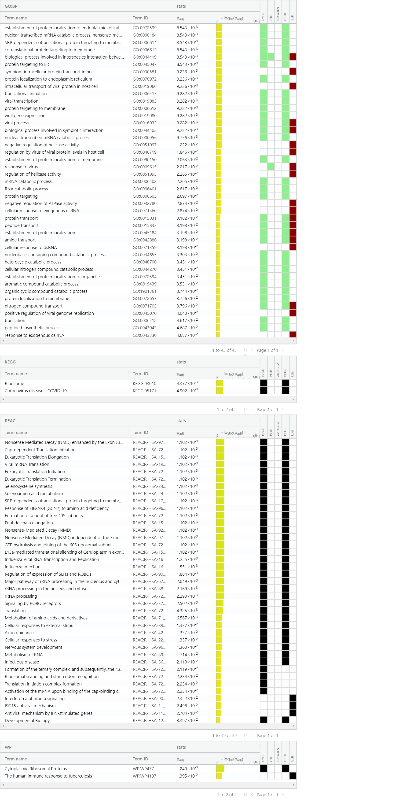

# Summary

First thing we want to do is to load data from A1 and A2, and install all required
packages for this assignment.

```{r, message=FALSE, results='hide', warning=FALSE, echo=FALSE}
#install Biocmanager in order to install necessary package
if (!requireNamespace("BiocManager", quietly = TRUE))
  install.packages("BiocManager")

#install necessary package if not installed
if (!requireNamespace("GEOmetadb", quietly = TRUE))
  BiocManager::install("GEOmetadb")

if (! requireNamespace("GEOquery", quietly = TRUE)) {
  BiocManager::install("GEOquery")
}

if (! requireNamespace("edgeR", quietly = TRUE)) {
  BiocManager::install("edgeR")
}

# install limma if not exist
if (! requireNamespace("limma", quietly = TRUE)) {
  BiocManager::install("limma")
}

if (! requireNamespace("ComplexHeatmap", quietly = TRUE)) {
  BiocManager::install("ComplexHeatmap")
}

if (! requireNamespace("circlize", quietly = TRUE)) {
  install.packages("circlize")
}

# packages required for GSEA analysis
if (! requireNamespace("RCurl", quietly = TRUE)) {
  BiocManager::install("RCurl")
}

if (! requireNamespace("ggplot2", quietly = TRUE)) {
  install.packages("ggplot2")
}

# Dark matter analysis 
if (! requireNamespace("GSA", quietly = TRUE)) {
  install.packages("GSA")
}

if (!requireNamespace("VennDiagram")) {
  install.packages("VennDiagram")
}

library(dplyr)
library(GEOmetadb)
library(GEOquery)
library(edgeR)
library(knitr)
library(RSQLite)
library(limma)
library(ComplexHeatmap)
library(circlize)
library(ggplot2)
library(RCurl)
library(GSA)
library(VennDiagram)

# load all data from A1 and A2 if files are missing
if (! file.exists("./normalized_data.rds") || ! file.exists("./filtered_data.rds")
    || ! file.exists("./data/mets_ranked_genelist.txt")){
  rmarkdown::render("A2_ZhiwenTan.Rmd")
}
```

## A1

Assignment 1 was focused on cleaning data by removing outliers, mapping gene id to HUGO gene symbols, and normalizing data with TMM method. Gene set information are shown as below

description for dataset
.
```{r, results='hide', message=FALSE}
# First, we want to get the description for dataset GSE145412. 
gse <- getGEO("GSE145412",GSEMatrix=FALSE)
```

```{r}
kable(data.frame(head(Meta(gse))), format = "html")
```

information associated with the dataset.

```{r, results='hide', warning=FALSE}
# Then, we want to get information about the dataset
current_gpl <- names(GPLList(gse))[1]
current_gpl_info <- Meta(getGEO(current_gpl))
```

**Platform Title:** `r current_gpl_info$title`\
**Original submission date:** `r current_gpl_info$submission_date`\
**Last update date:** `r current_gpl_info$last_update_date`\
**Organism:** `r current_gpl_info$organism`\
**No. of GEO datasets that use this technology:** `r length(current_gpl_info$series_id)`\
**No. of GEO samples that use this technology:** `r length(current_gpl_info$sample_id)`

normalized data are in the format below

```{r}
A1_normalized = readRDS("normalized_data.rds")
kable(A1_normalized[1:5,1:5], type="html")
```

## A2

The normalized data from Assignment #1 was ranked according to differential expression in Assignment 2. Then, we split up-regulated genes and down-regulated genes and store then into two files. After that, threshold over-representation analysis (g:Profiler) was performed on this data.and the top results are being analyzed.

The results are shown as below


After that, we saved the rank list into a text file under data folder. Now we need to convert this text file to a rnk file in order to run GSEA.

# Non-thresholded Gene set Enrichment Analysis

1. I choose to use GSEA for the Non-thresholded Gene set Enrichment Analysis, The geneset I used was from the baderlab geneset collection from March 1, 2021 containing GO biological process, no IEA and pathways.

## convert txt file to rnk file
```{r}
temp_data <- read.delim("data/mets_ranked_genelist.txt", header = FALSE)

write.table(x=temp_data, file=file.path("data","mets_ranked_genelist.rnk"),sep = "\t", row.names = FALSE,col.names = FALSE,quote = FALSE)

kable(temp_data[1:5,1:2], type="html")
```

Now we have a rnk file, next step is to run GSEA program

## GSEA setup
```{r initialize parameters}
#path to GSEA jar 
gsea_jar <- params$gsea_jar
java_version <- params$java_version

#Gsea takes a long time to run.  If you have already run GSEA manually or previously there is no need to re-run GSEA.  Make sure the 
# gsea results are in the current directory and the notebook will be able to find them and use them.
run_gsea = params$run_gsea

#navigate to the directory where you put the downloaded protocol files.
working_dir <- params$working_dir

gsea_directory = params$gsea_directory

analysis_name <- params$analysis_name
rnk_file <- params$rnk_file
expression_file <- params$expression_file
classes_file <- params$classes_file

is_docker <- params$is_docker
```

## Download the latest pathway definition file
```{r download baderlab gmt file, message=FALSE, warning=FALSE}
gmt_url = "http://download.baderlab.org/EM_Genesets/current_release/Human/symbol/"

#list all the files on the server
filenames = getURL(gmt_url)
tc = textConnection(filenames)
contents = readLines(tc)
close(tc)

#get the gmt that has all the pathways and does not include terms inferred from electronic annotations(IEA)
#start with gmt file that has pathways only
rx = gregexpr("(?<=<a href=\")(.*.GOBP_AllPathways_no_GO_iea.*.)(.gmt)(?=\">)",
  contents, perl = TRUE)
gmt_file = unlist(regmatches(contents, rx))

dest_gmt_file <- file.path(working_dir,paste("Supplementary_Table3_",gmt_file,sep="") )

download.file(
    paste(gmt_url,gmt_file,sep=""),
    destfile=dest_gmt_file
)
```

## Run GSEA

run GSEA with parameters. set maximum geneset size of 200, minimum geneset size of 15 and gene set permutation

```{r run GSEA}
if(run_gsea && java_version == "11"){
  command <- paste("",gsea_jar,  "GSEAPreRanked -gmx", dest_gmt_file, "-rnk" ,file.path(working_dir,rnk_file), "-collapse false -nperm 1000 -scoring_scheme weighted -rpt_label ",analysis_name,"  -plot_top_x 20 -rnd_seed 12345  -set_max 200 -set_min 15 -zip_report false -out" ,working_dir, " > gsea_output.txt",sep=" ")
  system(command)
} else if (run_gsea) {
  command <- paste("java  -Xmx1G -cp",gsea_jar,  "xtools.gsea.GseaPreranked -gmx", dest_gmt_file, "-rnk" ,file.path(working_dir,rnk_file), "-collapse false -nperm 1000 -permute gene_set -scoring_scheme weighted -rpt_label ",analysis_name,"  -num 100 -plot_top_x 20 -rnd_seed 12345  -set_max 200 -set_min 15 -zip_report false -out" ,working_dir, "-gui false > gsea_output.txt",sep=" ")
  system(command)
}
```

get output directory

```{r get output directory}
if(gsea_directory == ""){
  gsea_directories <- list.files(path = working_dir, pattern = "\\.GseaPreranked")
  #get the details on the files
  details = file.info(file.path(getwd(),working_dir,gsea_directories))
  #order according to newest to oldest
  details = details[with(details, order(as.POSIXct(mtime),decreasing = TRUE)), ]
  #use the newest file:
  gsea_output_dir <- row.names(details)[1]
} else {
  gsea_output_dir <- gsea_directory
}
```

## Result
All the result are stored in MetS.GseaPreranked folder under data directory. To obtain all the result for positive or negative. Below shows the top hits for postive and negative result.

```{r gsea_result}

gsea_dir <- file.path(getwd(),"data", gsea_directories[1])
#get the gsea result files  
gsea_results_files <- list.files(path = gsea_dir,
                                 pattern = "gsea_report_*.*.tsv")
#there should be 2 gsea results files  
enr_file1 <- read.table(file.path(gsea_dir, 
                        gsea_results_files[grepl("neg", gsea_results_files)]),
                        header = TRUE, sep = "\t", quote="\"",
                        stringsAsFactors = FALSE,row.names=1)  
enr_file2 <- read.table(file.path(gsea_dir, 
                        gsea_results_files[grepl("pos", gsea_results_files)]),
                        header = TRUE, sep = "\t", quote="\"",
                        stringsAsFactors = FALSE,row.names=1)

knitr::kable(enr_file1[1:20,c(1,4:8)], "html", 
             caption = "Top Down Regulated Enrichment Analysis Result")
knitr::kable(enr_file2[1:20,c(1,4:8)], "html", 
             caption = "Top Up Regulated Enrichment Analysis Result")

```

2. NEUTROPHIL MIGRATION was the top hit in na_negative(down-regulated) group with P-value: 0.00, ES: -0.88, NES: -1.91, FDR: 0.00.
There are 38 genes in its leading edge. PF4 is the top gene associated with this geneset
NEGATIVE REGULATION OF TYPE I INTERFERON-MEDIATED SIGNALING PATHWAY was the top hit in na_positive(up-regulated) group with P-value: 0.00, ES: 0.81, NES: 2.20, FDR: 0.037. There are 15 genes in its leading edge. OAS3 is the top gene associated with this geneset

## Compare to A2

Reload the result from A2



3. When compare the result with A2, we can see the result didn't change too much. both of them are related to neutrophil activation. For the up-regulated group, the tophits are different. But since the normal group did not have lots of data, so we can not make any conclusion here. Over all, the result from GSEA and the result from g:Profiler are consistent.

# Visualize Gene set Enrichment Analysis in Cytoscape

## setup Cytoscape

I decide to use Cytoscape locally. Since the Cytoscape can not recognize "---", so I opened pos and neg result file and mannually changed "---" to 1. The app we use was EnrichmentMap in Cytoscape

There are 803 nodes and 4982 edges in the result. The parameter I used was FDR set to 0.1, node cutoff(p-value) set to 1.0, edge cutoff set to 0.375(default). The blue node shows the down-regulated group, and the red node shows the up-regulated group. The initial network was shown below.


## Annotate network

For annotation, I used the AutoAnnotate app in Cytoscape. All parameter are set to default. Cluster algorithm is MCL Cluster, the edge weight column set to similarity_coefficient, Max words per label was 3, adjacent word bonus was set to 8. below shows all the parameters for annotation.


## publication ready figure

The publication ready figure was shown as below


## Theme network

From the graph, there are two large cluster which are antigen proteasome degradation (60 nodes) and glycolytic process biosynthetic(67 nodes). Most of the node are blue, which means the gene was down-regulated.

After create summarized network, the major themes present is antigen proteasome degradation, this related to immunity responds(Rivett,A.J, 2004). This can related to the result from GSEA and g:Profiler. The novel pathway would be glycolytic process biosynthetic since this pathway was not really mentioned in either GSEA and g:Profiler results.

A summarized network was shown below, cluster layout was set to CoSE


# Interpretation

1. The enrichment result not really close to the original paper. It is more close to the g:profiler result from thresholded methods. The difference are in the up-regulated group, but since this group only has a small number of data(only one red dot on the above graph), so the result change can not tell us too much.

2. There is evidence from Andersen et al.(2016), the article stated that MetS and obesity could cause inflammation and trigger immunu responds, this evidence directly supports the finding. This support that The top result for down-regulated genes are related to immune response, this could associated with MetS and obesity.

# Dark matter analysis

## capture Dark matter
```{r, warning=FALSE}
gmt_file <- file.path("data", "Supplementary_Table3_Human_GOBP_AllPathways_no_GO_iea_March_01_2021_symbol.gmt")

capture.output(genesets <- GSA::GSA.read.gmt(gmt_file), file = "gsa_loud.out")

# give proper indices/names
names(genesets$genesets) <- genesets$geneset.names

expression <- readRDS("normalized_data.rds")

# Load genes from enriched pathway 
all_enr_genesets <- c(rownames(enr_file1), rownames(enr_file2)) 
genes_enr_gs <- c()

for(i in 1:length(all_enr_genesets)){
  current_geneset <- unlist(genesets$genesets[which(genesets$geneset.names %in% all_enr_genesets[i])])
  genes_enr_gs <- union(genes_enr_gs, current_geneset)
}

ranks <- read.table(file.path(getwd(), "data", "ranked_list.tsv"),
                    header = TRUE, sep = "\t", quote = "\"",
                    stringsAsFactors = FALSE)

```

## Calculate dark matter
```{r}
FDR_threshold <- 0.001
#get the genes from the set of enriched pathwasy (no matter what threshold)
all_sig_enr_genesets<- c(rownames(enr_file1)[which(enr_file1[,"FDR.q.val"]<=FDR_threshold)], rownames(enr_file2)[which(enr_file2[,"FDR.q.val"]<=FDR_threshold)])
genes_sig_enr_gs <- c()
for(i in 1:length(all_sig_enr_genesets)){
  current_geneset <- unlist(genesets$genesets[which(genesets$geneset.names %in% all_sig_enr_genesets[i])]) 
  genes_sig_enr_gs <- union(genes_sig_enr_gs, current_geneset)
}

genes_all_gs <- unique(unlist(genesets$genesets))
```

## Venn Diagram of Dark Matter
```{r, warning=FALSE, message=FALSE, results='hide'}
A <- genes_all_gs
B <- genes_enr_gs
C <- rownames(expression)

venn_diagram_path <- file.path(getwd(),"image","dark_matter_overlaps.png")
png(venn_diagram_path)
VennDiagram::draw.triple.venn( area1=length(A), area2=length(B), area3 = length(C),
                  n12 = length(intersect(A,B)), n13=length(intersect(A,C)),
                  n23 = length(intersect(B,C)), 
                  n123 = length(intersect(A,intersect(B,C))),
                  category = c("all genesets","all enrichment results","expression"),
                  fill = c("red","green","blue"),
                  cat.col = c("red","green","blue")
)
dev.off()
```


## Get gene set
```{r}
# significant genes that are not annotated to any pathways in entire set of pathways used for the analysis
genes_no_annotation <- setdiff(C, A)

ranked_gene_no_annotation <- ranks[which(ranks[,1] %in% genes_no_annotation),]
knitr::kable(ranked_gene_no_annotation[1:10,], "html", caption = "Ranked gene without annotation")

# significant genes that are not annotated to any of the pathways returned in the enrichment analysis
genes_no_annotation_enr <- setdiff(C, B)

ranked_gene_no_annotation_enr <- ranks[which(ranks[,1] %in% genes_no_annotation_enr),]
knitr::kable(ranked_gene_no_annotation[1:10,], "html", caption = "Ranked gene without annotation enrichment analysis")
```

## Visualize Dark Matter with Heatmaps

we will use the same ComplexHeatmap and circlize R packages as in A2. ^9,10,11^\

First, I will show the heatmap of any significant genes that are not annotated to any of the pathways returned in the enrichment analysis.

```{r, warning=FALSE, results='hide', message=FALSE}
#get genes
enrich_heatmap_matrix <- expression[rownames(expression) %in% ranked_gene_no_annotation_enr$NAME,]

#normalize
enrich_heatmap_matrix <- t(scale(t(enrich_heatmap_matrix)))

if(min(enrich_heatmap_matrix) == 0){
  heatmap_col = colorRamp2(c( 0, max(enrich_heatmap_matrix)),
                           c( "white", "red"))
 } else {
   heatmap_col = colorRamp2(c(min(enrich_heatmap_matrix), 0,
                              max(enrich_heatmap_matrix)),
                            c("blue", "white", "red"))
 }
enrich_darkmatter_heatmap <- Heatmap(as.matrix(enrich_heatmap_matrix),
                           cluster_rows = TRUE,
                           cluster_columns = TRUE,
                           show_row_dend = TRUE,
                           show_column_dend = TRUE,
                           col=heatmap_col,
                           show_column_names = TRUE,
                           show_row_names = FALSE,
                           show_heatmap_legend = TRUE,
 )
```

```{r}
enrich_darkmatter_heatmap
```

Then, I will show the heatmap of any significant genes that are not annotated to any pathways in entire set of pathways used for the analysis

```{r, warning=FALSE, results='hide', message=FALSE}
#get genes
all_heatmap_matrix <- expression[rownames(expression) %in% ranked_gene_no_annotation$NAME,]

#normalize
all_heatmap_matrix <- t(scale(t(all_heatmap_matrix)))

if(min(all_heatmap_matrix) == 0){
  heatmap_col = colorRamp2(c( 0, max(all_heatmap_matrix)),
                           c( "white", "red"))
 } else {
   heatmap_col = colorRamp2(c(min(all_heatmap_matrix), 0,
                              max(all_heatmap_matrix)),
                            c("blue", "white", "red"))
 }
all_darkmatter_heatmap <- Heatmap(as.matrix(all_heatmap_matrix),
                           cluster_rows = TRUE,
                           cluster_columns = TRUE,
                           show_row_dend = TRUE,
                           show_column_dend = TRUE,
                           col=heatmap_col,
                           show_column_names = TRUE,
                           show_row_names = FALSE,
                           show_heatmap_legend = TRUE,
 )
```

```{r}
all_darkmatter_heatmap
```

# References


